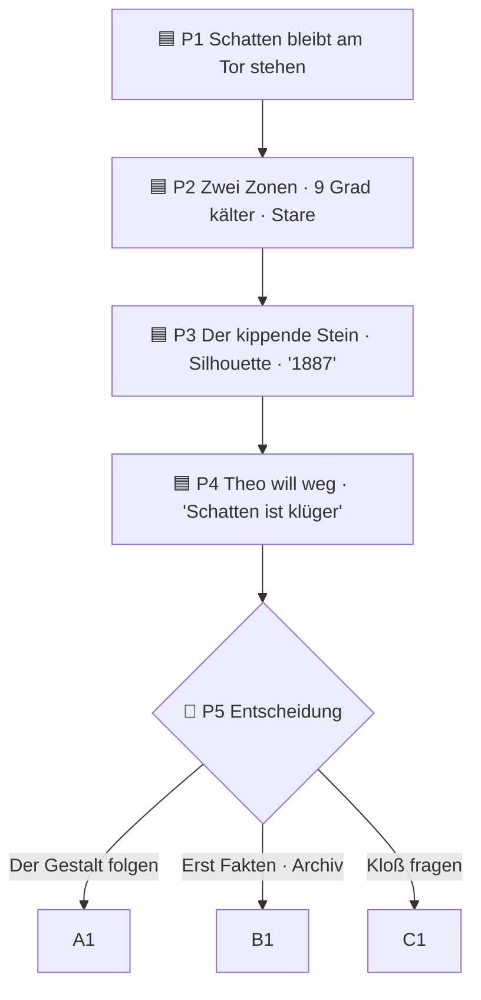
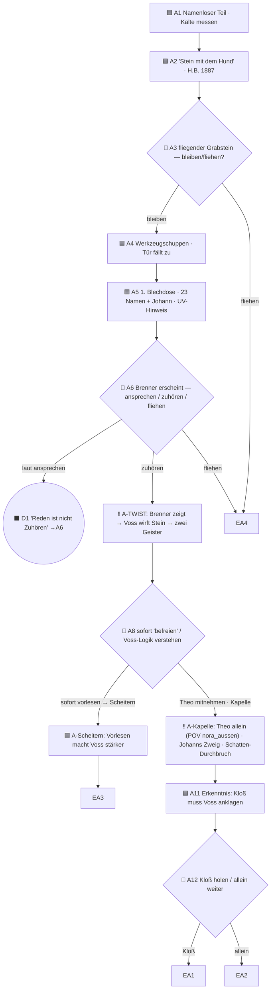
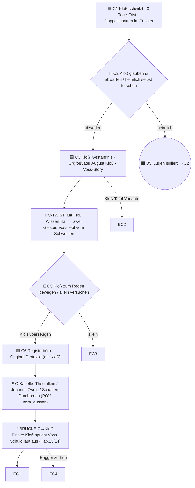
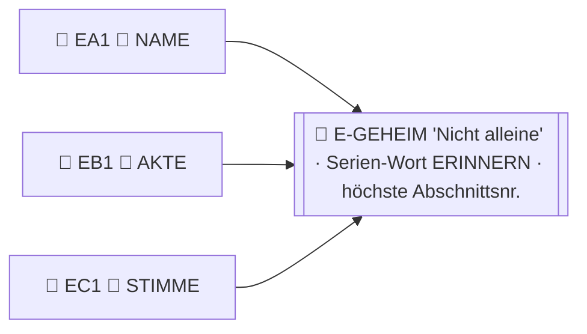
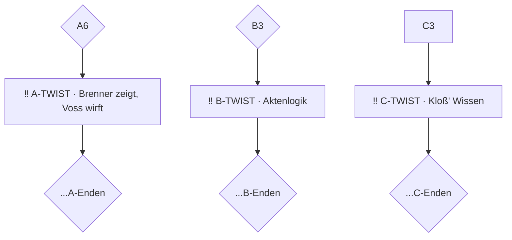
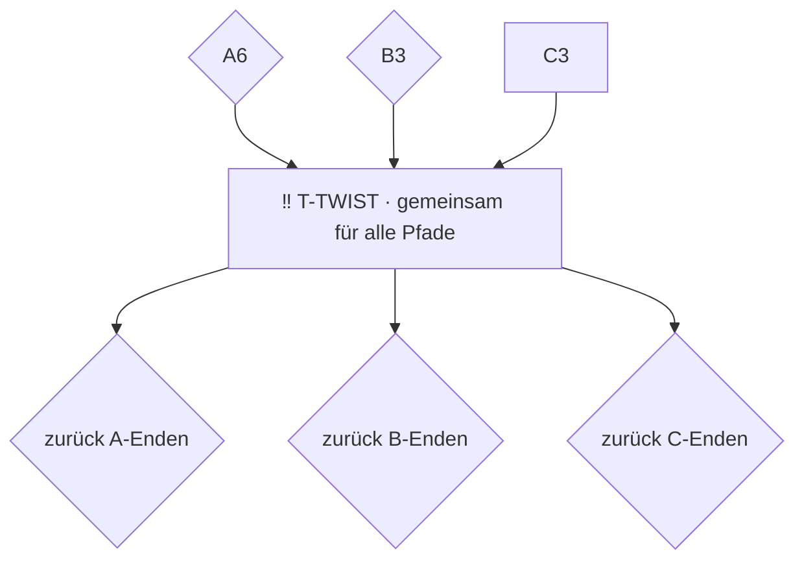

# Graph-Skizze — CYOA Band 2 (Schritt 1a)

> **Zweck:** Topologie *vor* dem YAML visuell prüfen. Noch keine Texte, keine endgültigen IDs-Targets.
> Zu entscheiden: **(1) Twist-Pol-Variante a vs. b** · **(2) Gesamttopologie freigeben.**
> Quellen: `Plan_Band2_CYOA.md` §2–§6, `KANON.md`. Knotenzahl-Schätzung am Ende.

---

## Legende

- 🟦 Story · 🔶 Wahl (choice) · ⬛ Dead End (zurückblättern) · 🏁 Ende
- ⭐ = bestes Ende des Pfads (trägt Codewort) · 🔑 = Codewort-Vergabe
- `‼️` = unverzichtbarer Beat (`unique_event`): Twist, Theo-allein, Johanns Zweig, Schatten-Durchbruch, Kloß-Mut

---

## Prolog (gemeinsam) — P1–P5



---

## Pfad A — „Dem Grauen folgen" (mutig/übernatürlich)



**A-Enden:** EA1 ⭐🔑 NAME „Der Zeuge spricht" · EA2 „Schattens Wache" (B3-Hook) · EA3 „Allein zu mutig" (Scheitern) · EA4 „Nacht-Flucht".

---

## Pfad B — „Die Ermittlerin" (rational/Recherche)

```mermaid
flowchart TD
    B1[🟦 B1 Stadtarchiv · Sektion-C-Seiten herausgerissen · H.B. + G. Voss]
    B2["🟦 B2 Grusel-Anker: Strich durch 'Voss' auf dem Foto · Silber-Spur"]
    B3{🔶 B3 Voss-Spur weiter / zurück zum Friedhof-Schuppen}
    B4[🟦 B4 Schuppen · 1. Dose · Buch-Hinweis]
    B5["‼️ B-TWIST: Aktenlogik → Poltergeist passt zu Voss, Brenner ist Opfer"]
    B6{🔶 B6 Registerbüro (Beweis) / direkt Kapelle (riskant)}
    B7["🟦 B7 Unterird. Registerbüro · Protokoll 1886 · Voss-Notiz"]
    B1-->B2-->B3
    B3-->|Voss-Spur|B5
    B3-->|Friedhof|B4
    B4-->B5-->B6
    B6-->|Beweise|B7
    B6-->|Eile|D4
    B7-->EB1
    D4((⬛ D4 'Zu viel Eile' →B6))
    B5-.->|ohne Handeln|D3((⬛ D3 'Wissen ohne Handeln' →B3))
```

**B-Enden:** EB1 ⭐🔑 AKTE „Aktenzeichen Voss" · EB2 „Die halbe Wahrheit" (unvollständig) · EB3 „Zu nah an Voss" (Eile-Scheitern).

> ⚠️ **Frage B:** Erreicht Pfad B den emotionalen Twist-Kern (Johanns Zweig) überhaupt, oder löst B den Fall
> „kühler" über Akten? Im Plan ist B der Recherche-Pfad — Vorschlag: B erreicht den Twist **über das
> Protokoll** (Voss' Schuld dokumentiert), Johanns Zweig bleibt A/C vorbehalten. Das gibt den Pfaden Profil.

---

## Pfad C — „Kloß vertrauen" (sozial/Erwachsene) — geplanter stärkster Pfad



**C-Enden:** EC1 ⭐🔑 STIMME „47 und ein kleiner Name" · EC2 „Die Gedenktafel" · EC3 „Ohne Kloß" (Teilerfolg) · EC4 „Zu spät" (bittersüß).

---

## Geheim-Ende (Codewort-System)



NAME + AKTE + STIMME → **ERINNERN**. Geheim-Ende-Hinweis am Buchende (Kasten/kursiv), führt zur höchsten Nummer.

---

# DIE ENTSCHEIDUNG: Twist-Pol Variante a vs. b

Der Twist-Kern („zwei Geister · Vorlesen reicht nicht · Voss muss angeklagt werden") muss laut Plan auf
**allen** Pfaden vorkommen. Im Graph oben ist er als **A7 / B5 / C4** modelliert. Das ist **Variante a**.

### Variante a — drei getrennte Twist-Abschnitte (oben gezeichnet)



- ✅ **Time-Cave bleibt sauber** — 0 zusätzliche Konvergenz, Validator grün.
- ✅ Jeder Pfad erlebt den Twist **in seiner eigenen Sprache** (mutig / kühl / sozial) → starke Pfad-Identität.
- ⚠️ **Preis:** 3 Abschnitte mit gleichem *Kern* → Recycling-Gefahr. Gegenmittel: Anti-Recycling-Liste
  (STIL_REFERENZ §5), bewusst verschiedene Inszenierung. Mehr Schreibarbeit (3 statt 1).

### Variante b — ein gemeinsamer Konvergenz-Twist



- ✅ Twist garantiert **identisch**, nur **1 Abschnitt** zu schreiben, kein Recycling.
- ⚠️ **Preis:** **zweiter Konvergenzpunkt** (neben C→Kloß-Finale) → bricht die selbst gesetzte Time-Cave-Regel,
  **Validator wirft Konvergenz-Warnung**, und nach dem gemeinsamen T muss man die Leser sauber auf ihren
  Pfad **zurücksortieren** (T braucht 3 Ausgänge je nach Herkunft → unschön / fehleranfällig im Buchformat,
  weil der Leser nur „weiter mit Nr. X" liest und nicht weiß, „woher" er kam).

### Mein Argument (Empfehlung)

**Variante a.** Begründung, die das Buch besser macht — nicht nur die Regel erfüllt:
1. In einem **gedruckten** CYOA ist Rück-Sortierung nach einem Konvergenzknoten praktisch unmöglich
   (kein Zustand, nur „weiter mit Nr. X"). Variante b müsste den Twist faktisch doch dreifach ausgeben.
2. Die **Pfad-Identität** (A mutig / B kühl / C sozial) ist der Mehrwert eines Mehrpfad-Buchs. Genau am
   Twist — dem Höhepunkt — ist identischer Text die größte verschenkte Chance.
3. Das Recycling-Risiko ist **beherrschbar** (Liste + Manuskript hat schon drei verschiedene Inszenierungen
   vorgezeichnet: Brenner zeigt [Kap. 7], Aktenlogik [Kap. 12], Kloß' Geständnis [Kap. 6/13]).

---

# Zweite Architektur-Frage: Theo-allein / Johanns Zweig — auf welchen Pfaden?

Das ist der **emotionale Höhepunkt** (Kap. 11). Im Manuskript passiert er **einmal**. Im CYOA-Graph oben
ist er auf **A (A10) und C (C7)** — **nicht** auf B.

- **Pro (A+C):** Beide sind „am Friedhof handelnde" Pfade; der Beat ist die Belohnung fürs Risiko (Theo
  mitnehmen). B ist der Recherche-/Distanz-Pfad → dort wirkt er aufgesetzt.
- **Risiko:** Wieder ein Beat, der auf 2 Pfaden steht → Recycling. Gegenmittel: in A aus dem „Folgen"
  heraus, in C aus „mit Kloß" heraus — verschiedene Vorläufe, gleicher Kern-Fund.
- **Alternative (zu entscheiden):** Johanns Zweig **nur auf C** (dem stärksten Pfad), A erreicht den
  Twist über Brenners Zeigen ohne den Zweig. Spart einen Doppel-Beat, schwächt aber A emotional.

> Vorschlag: **A + C** behalten (wie gezeichnet), Recycling über Vorlauf-Variation lösen.

---

# Knotenzahl-Schätzung (fällt erst hier, nicht vorab)

| Block | Knoten |
|------|--------|
| Prolog P1–P5 | 5 |
| Pfad A (A1–A12 inkl. Scheiter/Kapelle-Zweig) | ~13 |
| Pfad B (B1–B7) | ~8 |
| Pfad C (C1–C8) | ~9 |
| Dead Ends D1, D3, D4, D5 | 4 |
| Enden EA1–4, EB1–3, EC1–4 | 11 |
| Geheim-Ende | 1 |
| **Summe** | **~51** |

→ Liegt unter dem Richtwert 55–65 → **gesund** (Tiefe statt Menge, Plan §9a). Reserve für 2–3
Zwischen-Abschnitte vorhanden, falls ein Übergang zu gedrängt wirkt. **Finale Zahl nach 1b.**

---

# Offene Punkte für deine Freigabe (1a)

1. **Twist-Pol: Variante a** (3 getrennte) — bestätigen?
2. **Theo-allein/Johanns Zweig auf A+C** (nicht B) — bestätigen?
3. **Pfad B erreicht Twist über Akten/Protokoll** (ohne Johanns Zweig) — ok?
4. **Topologie insgesamt** (Wahlpunkte/Enden-Zuordnung oben) — Einwände?
5. Klein-Klär (aus KANON): **UV-Lampe = aus Silbers Wohnung** · **„M. Silber" im CYOA erwähnen ja/nein** —
   jetzt oder im Schreibschritt?
